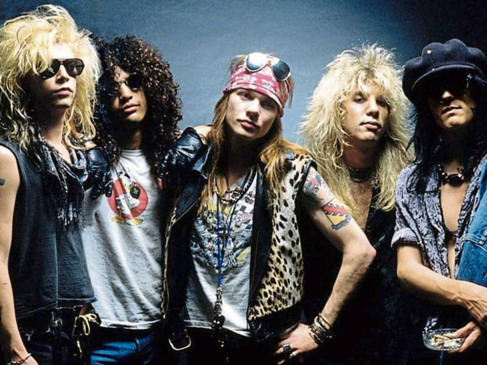
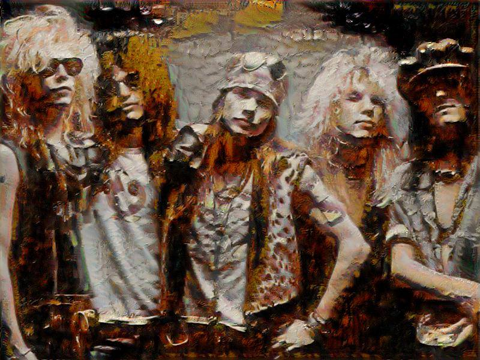

# Neural_style_transfer
implementation of neural style transfer in Tensorflow

Input image:

Style image:

Output image:

Parameters:

1. weights of all layers for style loss= 0.2 as per paper

2. alpha=200

3. beta=5

4. optimizer=Adam:epsilon=6

5. based on the VGG 16 network

References:

https://arxiv.org/pdf/1705.04058.pdf

https://github.com/anishathalye/neural-style
